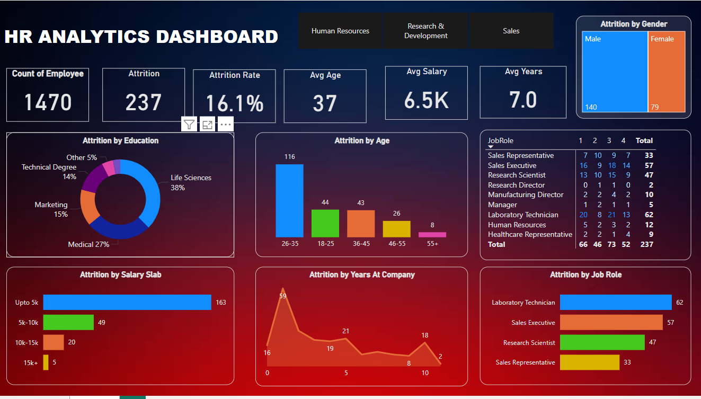

# HR_Analytics_Dashboard
Help an organization to improve employee performance and improve employee retention (reduce.attrition) by creating a HR Analytics dashboard

# 📊 HR Analytics Dashboard

## 🎯 Objective
The goal of this project is to help an organization **enhance employee performance** and **reduce attrition** by identifying key factors that influence employee turnover using a Power BI dashboard.

---

## 🗂️ Dataset Overview

- **Total Employees**: 1470  
- **Employees who left (Attrition)**: 237  
- **Attrition Rate**: 16.1%  
- **Average Age**: 37 years  
- **Average Salary**: ₹6.5K  
- **Average Years at Company**: 7.0 years

---

### 📁 Project Files

| File Name                     | Description                            |
|------------------------------|-----------------------------------------|
| `HR_Analytics.csv`           | Source dataset                          |
| `HR_Analytics_Dashboard.pbix`| Power BI report file                    |
| `BG12.jpg`                   | Dashboard background image              |
| `Dashboard.png`              | Exported image of the dashboard         |

---

## 📊 Dashboard Preview

Here's a snapshot of the final interactive dashboard for quick insights:

## 📌 Key Visuals & Insights

### ✅ Attrition by Age Group
- Highest attrition in **26–35** age range.
- Lower attrition in employees aged **46+**.

### 🎓 Attrition by Education Field
- Life Sciences: 38%  
- Medical: 27%  
- Marketing: 15%  
- Technical Degree: 14%  
- Other: 5%

### 💰 Attrition by Salary Slab
- Most attrition in **₹0–5K** range (163 employees).
- Very few leave when salary is above ₹10K.

### 👔 Attrition by Job Role
- **Laboratory Technician**: 62  
- **Sales Executive**: 57  
- **Research Scientist**: 47  
- **Sales Representative**: 33

### 👥 Attrition by Gender
- **Male**: 140  
- **Female**: 79

### ⏳ Attrition by Years at Company
- Peaks at **0–1 years** and again at **5–10 years**.

### 🏢 Attrition by Department
- Most attrition in **Research & Development** and **Sales**.
- Least attrition in **Human Resources**.

---

## 🧠 Recommendations

- **Review compensation** for low-earning employees (< ₹5K).
- **Support onboarding and early-stage employees** to reduce 0–1 year attrition.
- **Focus on high-turnover roles and departments** with targeted engagement programs.
- Promote career development and satisfaction for mid-career professionals (5–10 years).

---

## 🛠️ Tools Used
- **Power BI Desktop**
- Visualizations: KPI Cards, Bar Charts, Donut Charts, Tables
- Data Modeling & DAX for custom insights

---
